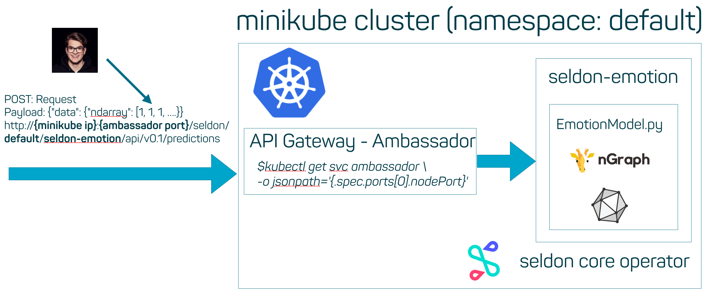
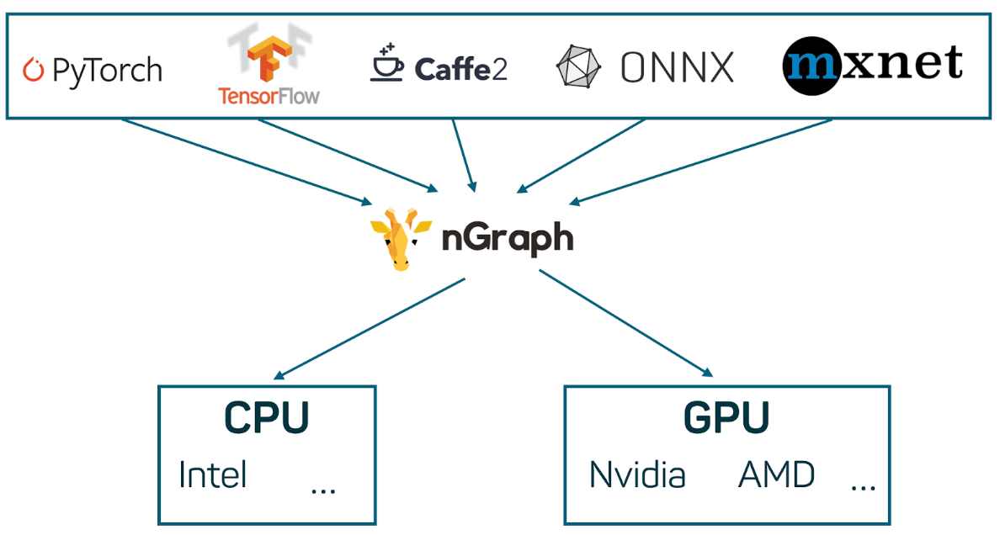

# seldon-core-onnx
This repository shows how to serve an ONNX model with seldon-core. We are deploying a deep convolutional neural network for emotion recognition in faces in a local Kubernetes cluster. The [ONNX model](https://github.com/onnx/models/tree/master/vision/body_analysis/emotion_ferplus) can be found in the [onnx/models repository](https://github.com/onnx/models).

## Blog Article
- English:
- German:

## Application overview

We are deploying a model in a Kubernetes to perform emotion recogniton on a face.  

## Repository Overview
- [images](images/): Contains the test image [smile.jpg](images/smile.jpg) and documentation images
- [model/model.onnx](model/model.onnx): [emotion_ferplus](https://github.com/onnx/models/tree/master/vision/body_analysis/emotion_ferplus)
- [Dockerfile](Dockerfile): Dockerfile to run application local
- [EmotionModel.py](EmotionModel.py): Python wrapper for seldon-core
- [Seldon_Kubernetes.ipynb](Seldon_Kubernetes.ipynb): Tutorial code to deploy model on Kubernetes
- [client.py](client.py): Client script to test the deployed Kubernetes model
- [emotion_service_deployment.json](emotion_service_deployment.json): Kubernetes deployment template for seldon-core-operator
- [nGraph_ONNX_Example.ipynb](nGraph_ONNX_Example.ipynb): nGraph ONNX example
- [payload.json](payload.json): [smile.jpg](images/smile.jpg) as json representation for testing.

## Installation
We need the following requirements:
- [minikube](https://github.com/kubernetes/minikube): local Kubernetes cluster
- [helm](https://helm.sh/): Package manager for Kubernetes
- [s2i (source-to-image)](https://github.com/openshift/source-to-image): Create containers through templates and source code
 
## Run seldon-core with Docker
Clone repository and `CD` into the folder.
```
docker build -t emotion_service:0.1 . && docker run -p 5000:5000 -it emotion_service:0.1 
```
Run the following script with Python:
```python
from PIL import Image
import numpy as np
import requests
path_to_image = "images/smile.jpg"
image = Image.open(path_to_image).convert('L')
resized = image.resize((64, 64))
values = np.array(resized).reshape(1, 1, 64, 64)
req = requests.post("http://localhost:5000/predict", json={"data":{"ndarray": values.tolist()}})
```
## Tutorial with Kubernetes
All commands to set up the model on the Kubernetes cluster can be found in the [Seldon_Kubernetes.ipynb](Seldon_Kubernetes.ipynb) notebook.

## Inference with nGraph

Take a look into the [nGraph compiler repository](https://github.com/NervanaSystems/ngraph).
```python
from ngraph_onnx.onnx_importer.importer import import_onnx_file
import ngraph as ng
# Import the ONNX file
model = import_onnx_file('model/model.onnx')

# Create an nGraph runtime environment
runtime = ng.runtime(backend_name='CPU')

# Select the first model and compile it to a callable function
emotion_cnn = runtime.computation(model)
```

## Testing
```
minikube ip
kubectl get svc ambassador -o jsonpath='{.spec.ports[0].nodePort}'
curl -vX POST http://192.168.99.100:30809/seldon/default/seldon-emotion/api/v0.1/predictions -d @payload.json --header "Content-Type: application/json"
```